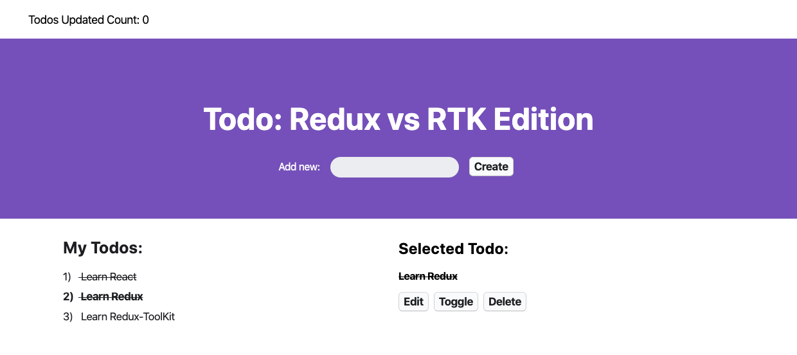

# React Redux Toolkit



## Create this project

1) created a Typescript template create-react-app project 
```js
 npx create-react-app rtk --template typescript`
```

2) optional=> installed `prettier` by creating the `.eslintrc.json` file to link prettier and ESLint together.

3) installed `uuid` and `@types/uuid` to be able to generate unique IDs.
```js
npm install uuid '@types/uuid'

4) removed most of the starter code that CRA gives and npm start.
